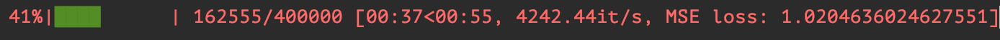

# ML-ALGO
 Implementation of most popular ML algorithms

- ### [Neural netwroks](networks)
  Implementation of [*Multilayer perceptron*](https://en.wikipedia.org/wiki/Multilayer_perceptron).
  Used naive [*Stochastic Gradient Descent*](https://en.wikipedia.org/wiki/Stochastic_gradient_descent)
  to minimize [*Loss function*](https://en.wikipedia.org/wiki/Loss_function).

  #### Also you can check your progress via progress bar (implemented via [*tqdm*](https://github.com/tqdm/tqdm))
  

  Don't support **GPU and parallel** evaluations.

  #### To do in future:
    - [Momentum](https://en.wikipedia.org/wiki/Momentum_(technical_analysis))
    - [Adam](https://arxiv.org/abs/1412.6980)
    - NAG
    - RMSProp
    - Nadam
    - AdaDelta

  Other optimizations overwied [here](https://towardsdatascience.com/deep-learning-optimizers-436171c9e23f)

  **Main classes**:
    - [Network class](networks/Network.py)
    - [Loss functions](networks/base/function/Loss.py)
    - [Activation functions](networks/base/function/ActivationFunction.py)

- ### [Recommendation systems](rec_sys)
    Implementation of **Matrix factorizations** algorithms.

    - [Matrix factorizations](rec_sys/MF)
        - [SVD](rec_sys/MF/StochasticGradientDescentSVD.py)
        - [ALS](rec_sys/MF/ALS.py)
        - [BPR](rec_sys/MF/BPR.py)
        - [WARP](rec_sys/MF/WARP.py)
